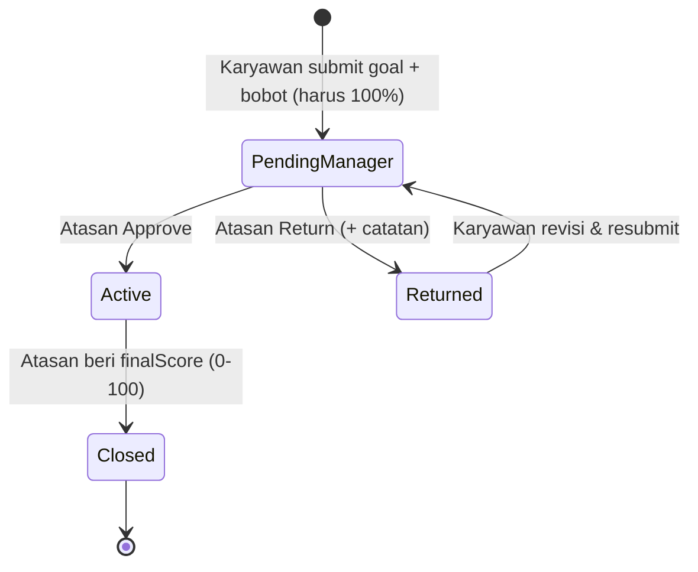
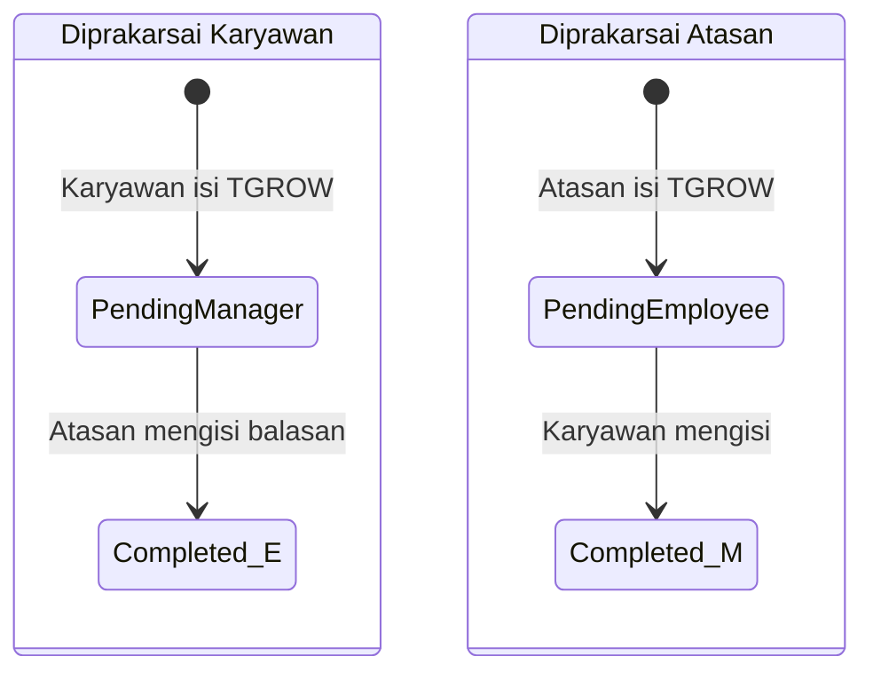
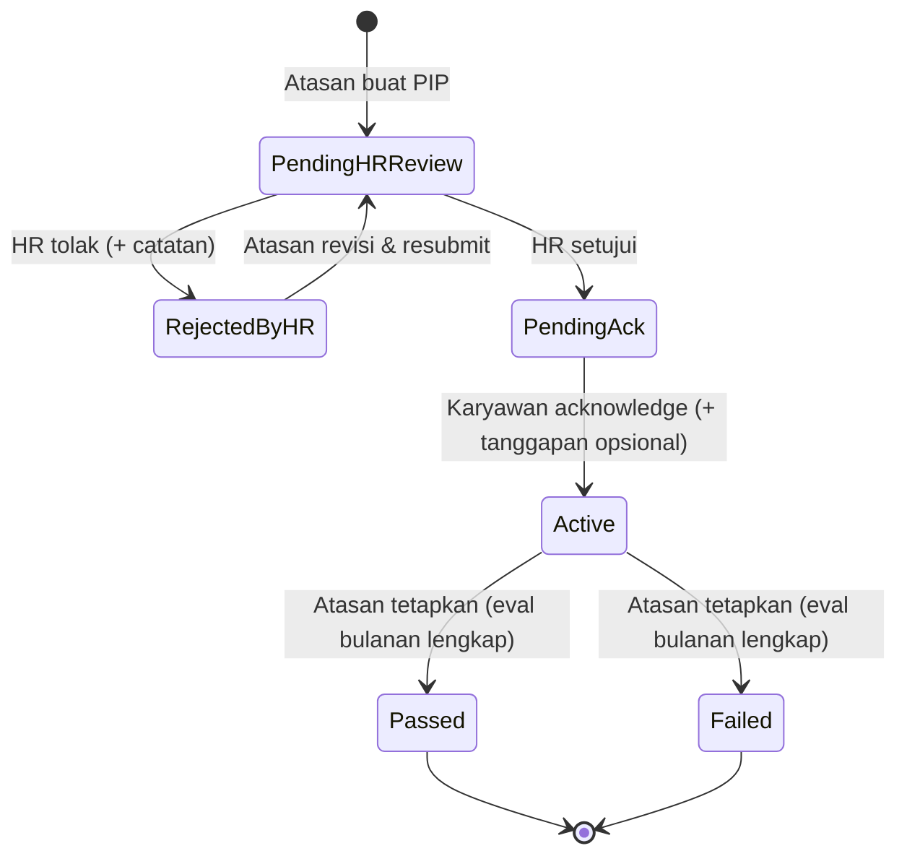
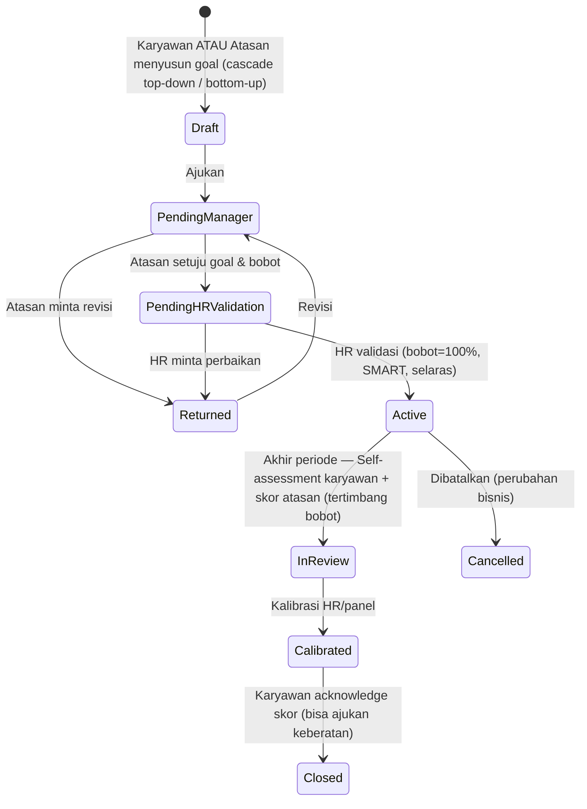
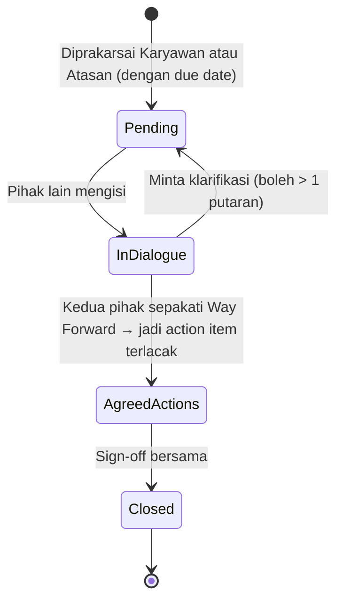
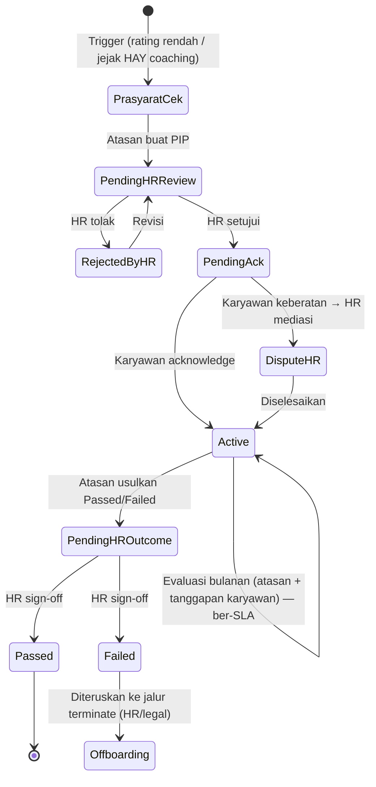

# Analisis & Simulasi Proses HR: VIP, HAY, dan PIP

> Dokumen ini mensimulasikan tiga proses performance di prototype ini — **VIP**, **HAY**, dan **PIP** — dari sisi *input karyawan* maupun *input atasan* (dan sebaliknya), lalu titik *pengecekan HR*. Tujuannya: menemukan **lubang (gap) alur & proses** dan mengusulkan **proses HR yang ideal**.

Basis kode yang dianalisis:
- `src/store/vipStore.js`, `src/store/hayStore.js`, `src/store/pipStore.js`
- `src/components/performance/EssCheckIn.jsx` (karyawan), `MssCheckIn.jsx` (atasan)
- `src/app/(protected)/hr/performance/check-in/page.jsx` (HR — VIP & HAY, read-only)
- `src/app/(protected)/hr/performance/pip/page.jsx` (HR — PIP, ada gate approve/reject)
- `src/components/layout/NotificationBell.jsx` (notifikasi transisi)

Ringkasan peran per proses saat ini:

| Proses | Pemrakarsa | Peran Atasan | Peran HR saat ini |
|--------|-----------|--------------|-------------------|
| **VIP** | Karyawan saja | Approve / Return / Rating akhir | **Read-only** (tidak mengecek apa pun) |
| **HAY** | Karyawan *atau* Atasan | Mengisi/membalas TGROW | **Read-only** (lihat semua sesi) |
| **PIP** | Atasan saja | Buat, evaluasi bulanan, tetapkan hasil | **Gate approve/reject di awal** (tidak terlibat setelahnya) |

---

## 1. VIP — Valuing Improvement & Progress

### 1.1 Alur saat ini (as-is)

### 1.2 Simulasi

1. Budi (karyawan) membuat sesi "OKR Q3 2025", 2 topik, bobot 60% + 40% = 100% → **Pending Manager**.
2. Ahmad (atasan) melihat, lalu **Approve** → **Active** *(atau Return dengan catatan → Budi revisi → Pending Manager lagi)*.
3. Akhir periode, Ahmad memberi **finalScore** + catatan → **Closed**.
4. HR: hanya bisa **melihat** di `hr/performance/check-in`. Tidak ada aksi.

### 1.3 Lubang yang ditemukan

| # | Lubang | Dampak |
|---|--------|--------|
| V1 | **HR tidak punya peran sama sekali** — hanya read-only. Padahal permintaan: "dicek oleh HR". | Tidak ada governance kualitas goal, tidak ada kalibrasi antar-tim. |
| V2 | **Tidak ada jalur atasan → karyawan (top-down goal / cascade)**. VIP hanya bisa dibuat karyawan. | Goal strategis dari atasan/perusahaan tidak bisa diturunkan sebagai VIP. |
| V3 | **Bobot (weight) tidak dipakai dalam penilaian**. `finalScore` bebas 0–100, tidak terhubung ke bobot topik. | Bobot jadi hiasan; skor subjektif satu penilai. |
| V4 | **Rating sepihak atasan, tanpa self-assessment & tanpa hak tanggapan karyawan**. `Closed` final tanpa acknowledgement. | Bias penilai tunggal, tidak ada suara karyawan, tidak ada appeal. |
| V5 | **Tidak ada periode (start/end) & tidak ada kalibrasi**. Hanya `date`. "Akhir periode" tak terdefinisi. | Rating bisa dilakukan kapan saja; tidak ada normalisasi antar-manajer. |
| V6 | **Setelah Active, karyawan tidak bisa update progress/check-in notes**. Padahal inti "Progress". | Check-in berkala tidak terjadi; goal statis. |
| V7 | **Tidak ada `ratedBy` / jejak audit rating**, tidak ada status **Cancelled/Withdrawn**. | Lemah untuk audit & pembatalan goal yang tidak lagi relevan. |
| V8 | **Goal tidak bisa diubah di tengah periode** (mid-year adjustment) selain lewat Return sebelum Active. | Realita bisnis berubah; goal tidak fleksibel. |

---

## 2. HAY — How Are You? (framework T-G-R-O-W)

### 2.1 Alur saat ini (as-is) — **dua arah**

### 2.2 Simulasi

- **Arah 1 (karyawan → atasan):** Budi isi TGROW → **Pending Manager** → Ahmad membalas → **Completed**.
- **Arah 2 (atasan → karyawan):** Ahmad membuat sesi → **Pending Employee** → Budi mengisi → **Completed**.
- HR: melihat semua sesi (termasuk isi reflektif) di `hr/performance/check-in`.

### 2.3 Lubang yang ditemukan

| # | Lubang | Dampak |
|---|--------|--------|
| H1 | **HR melihat SELURUH isi HAY tanpa kontrol kerahasiaan**. HAY = percakapan coaching personal ("How Are You"). | Risiko privasi; karyawan enggan jujur bila tahu HR baca semua. |
| H2 | **Hanya satu putaran**. Begitu satu pihak mengisi → langsung `Completed`. Tidak ada return/klarifikasi. | Tidak ada dialog bolak-balik; tidak ada kesepakatan bersama. |
| H3 | **Tidak ada sign-off / persetujuan bersama**. `Completed` = sekadar dua pihak mengisi. | Tidak ada bukti kesepakatan atas *Way Forward*. |
| H4 | **Way Forward tidak menjadi action item yang bisa dilacak**. "Follow-up dari HAY sebelumnya" hanya tampilan. | Tindak lanjut tidak terkelola; siklus coaching putus. |
| H5 | **Tidak ada SLA/jatuh tempo**. Sesi "Pending" bisa menggantung selamanya (hanya ada *nudge* 30 hari di ESS). | Coaching mandek tanpa akuntabilitas. |
| H6 | **Tidak bisa edit setelah submit (tidak ada draft)**. | Salah ketik terkunci. |
| H7 | **Tidak ada jembatan HAY → PIP**. Bila coaching berulang gagal, tidak ada eskalasi terstruktur. | PIP jadi kejutan tanpa jejak coaching (praktik terbaik: PIP didahului coaching). |

---

## 3. PIP — Performance Improvement Plan

### 3.1 Alur saat ini (as-is) — **satu-satunya yang punya gate HR**

### 3.2 Simulasi

1. Ahmad membuat PIP untuk Budi (alasan, KPI, periode) → **Pending HR Review**.
2. HR meninjau → **Approve** (→ Pending Acknowledgement) atau **Reject** (→ Rejected by HR → Ahmad revisi & resubmit).
3. Budi **acknowledge** (bisa menambah tanggapan) → **Active**.
4. Ahmad mengisi evaluasi bulanan (kolom "sudah" wajib untuk semua bulan) lalu menetapkan **Passed/Failed**.

### 3.3 Lubang yang ditemukan

| # | Lubang | Dampak |
|---|--------|--------|
| P1 | **HR hilang setelah approve awal**. Outcome **Failed** — yang di *Pernyataan* bisa berujung PHK — ditetapkan **sepihak oleh atasan tanpa sign-off HR**. | **Risiko hukum/ketenagakerjaan terbesar.** Keputusan berkonsekuensi PHK tanpa kontrol HR. |
| P2 | **Acknowledgement adalah satu-satunya suara karyawan, dan bisa memblokir alur**. Jika karyawan tak pernah acknowledge → status **macet di Pending Acknowledgement** selamanya. Tidak ada timeout/eskalasi. | Karyawan bisa menyandera PIP; atau sebaliknya dipaksa "setuju" agar bisa lanjut. |
| P3 | **Evaluasi bulanan hanya sisi atasan**. Karyawan tidak bisa mencatat versinya. | Bukti sepihak untuk keputusan yang bisa berujung PHK; tidak adil. |
| P4 | **Outcome → tidak terhubung ke offboarding/terminate**. "Failed" mentok sebagai status. | Proses terputus; keputusan PHK tanpa jalur legal/HR resmi. |
| P5 | **Tidak ada prasyarat/trigger PIP** (mis. rating rendah / bukti coaching HAY sebelumnya). Atasan mana pun bisa mem-PIP siapa pun. | Risiko PIP retaliatif/subjektif. |
| P6 | **Tanpa SLA & tanpa validasi tanggal** (endDate bisa < startDate; eval bisa diisi hari-1 lalu langsung Failed). | Bisa disalahgunakan; periode perbaikan semu. |
| P7 | **Tidak ada mekanisme appeal atas Failed**, tidak ada `outcomeBy`/jejak, ping-pong reject tak terbatas. | Lemah audit & keadilan prosedural. |

---

## 4. Lubang Lintas-Proses (Cross-cutting)

1. **Definisi "dicek HR" tidak konsisten:** VIP & HAY = pasif (lihat), PIP = aktif (gate). Tidak ada standar governance.
2. **Notifikasi ada, tetapi tanpa SLA/reminder/eskalasi** (`NotificationBell` hanya notifikasi transisi satu kali).
3. **Tidak ada status Cancelled/Withdrawn** di ketiga proses.
4. **Tidak ada kalibrasi/skip-level/HR Business Partner** di mana pun.
5. **Jejak audit minim** (`ratedBy`, `outcomeBy`, timestamp per aksi tidak lengkap).
6. **Tidak ada keterhubungan antar-proses**: HAY (coaching) → VIP (goal) → PIP (perbaikan) → Offboarding berjalan sebagai pulau terpisah.

---

## 5. Proses HR Ideal (to-be)

Prinsip: **suara dua arah**, **HR sebagai penjaga governance & keadilan prosedural**, **SLA + eskalasi**, **keterhubungan antar-proses**, dan **jejak audit lengkap**.

### 5.1 VIP ideal — tambah gate HR, self-assessment, & kalibrasi

Perubahan kunci: **(a)** VIP dua arah (karyawan & atasan), **(b)** gate **HR validasi** goal & bobot, **(c)** **self-assessment** + skor **tertimbang bobot**, **(d)** **kalibrasi HR**, **(e)** **acknowledgement + keberatan** karyawan, **(f)** update progress berkala saat Active, **(g)** status **Cancelled**.

### 5.2 HAY ideal — dialog, kerahasiaan, & action item

Perubahan kunci: **(a)** dialog bolak-balik, **(b)** *Way Forward* → **action item** yang dilacak & ditarik ke HAY berikutnya, **(c)** **sign-off bersama**, **(d)** **due date + reminder**, **(e)** **kerahasiaan**: HR hanya melihat **metadata/agregat** (frekuensi, kepatuhan cadence) — bukan isi reflektif — kecuali sesi dieskalasikan, **(f)** tombol **Eskalasi ke PIP** bila pola berulang.

### 5.3 PIP ideal — HR di kedua ujung, suara karyawan, & eskalasi resmi

Perubahan kunci: **(a)** **prasyarat/trigger** sebelum PIP, **(b)** **HR sign-off pada outcome** (bukan hanya di awal) — terutama **Failed**, **(c)** **timeout acknowledgement** + jalur **keberatan/mediasi HR** agar tidak macet, **(d)** evaluasi bulanan **dua sisi** (atasan + karyawan) ber-**SLA/tanggal valid**, **(e)** **Failed → tersambung ke workflow offboarding/terminate** yang sudah ada, **(f)** **appeal** + jejak `outcomeBy`.

---

## 6. Prioritas Rekomendasi (jika diimplementasikan)

| Prioritas | Item | Proses |
|-----------|------|--------|
| 🔴 Tinggi | HR sign-off pada **outcome PIP** (khususnya Failed) + sambungan ke offboarding | PIP (P1, P4) |
| 🔴 Tinggi | **Timeout & jalur keberatan** acknowledgement PIP | PIP (P2) |
| 🔴 Tinggi | **Self-assessment + acknowledgement/keberatan** rating VIP | VIP (V4) |
| 🟠 Sedang | **Gate HR validasi** goal & bobot VIP + skor tertimbang | VIP (V1, V3, V5) |
| 🟠 Sedang | Evaluasi PIP **dua sisi** + validasi tanggal/SLA | PIP (P3, P6) |
| 🟠 Sedang | **Kerahasiaan HAY** (HR lihat agregat, bukan isi) | HAY (H1) |
| 🟢 Rendah | Dialog & **sign-off** HAY, action item terlacak | HAY (H2–H4) |
| 🟢 Rendah | Status **Cancelled/Withdrawn** + jejak audit `ratedBy/outcomeBy` | Semua |
| 🟢 Rendah | VIP **dua arah** (cascade atasan) & update progress saat Active | VIP (V2, V6) |

---

---

## 7. Status Implementasi (sudah dikerjakan)

Seluruh rancangan ideal di atas **sudah diimplementasikan** pada store & UI:

**PIP** (`pipStore.js`, `MssCheckIn`, `EssCheckIn`, `hr/performance/pip`)
- ✅ HR **sign-off outcome** (`Pending HR Outcome` → HR sahkan/kembalikan); atasan kini hanya **mengusulkan** hasil.
- ✅ Karyawan dapat **keberatan** (`Disputed`) → **mediasi HR** (`resolveDispute`).
- ✅ Evaluasi bulanan menyimpan sisi karyawan (`addEmployeeEval`).
- ✅ Outcome **Failed** dapat **diteruskan ke offboarding** (checkbox HR).
- ✅ **Banding** karyawan atas Failed (`appealPip`) + jejak `outcomeProposedBy/outcomeConfirmedBy`.

**VIP** (`vipStore.js`, `MssCheckIn`, `EssCheckIn`) — **hanya atasan & karyawan, TANPA gate HR**
- ✅ Alur: Karyawan ajukan → Atasan `Approve`/`Return` → `Active` (langsung, tanpa HR).
- ✅ **Self-assessment** karyawan (`In Review`) sebelum penilaian atasan.
- ✅ **Skor tertimbang bobot** per-topik (`computeWeightedScore`).
- ✅ **Acknowledgement/keberatan** karyawan atas nilai (`Pending Employee Ack` → `Closed`).
- ✅ jejak `ratedBy`, status `Cancelled` (store).

**PIP — input hasil oleh karyawan**
- ✅ Setelah `Active`, **karyawan mengisi hasil**: capaian **Bulan I/II/III** per KPI dan tabel **Evaluasi** (Perbaikan sudah/belum dilakukan + Action Plan). Atasan meninjau sebelum mengusulkan hasil.

**HAY** (`hayStore.js`, `hr/performance/check-in`)
- ✅ **Kerahasiaan**: HR hanya melihat **metadata/agregat**, bukan isi reflektif.
- ✅ **Dialog >1 putaran** (`requestClarification`), **sign-off bersama** (`signOffHay`), **action items** (`setActionItems/toggleActionItem`), **due date**.

*Catatan: prototype berbasis Zustand + `dbStorage`; versi store dinaikkan (vip-v4, hay-v3, pip-v3) agar skema baru ter-seed bersih.*
